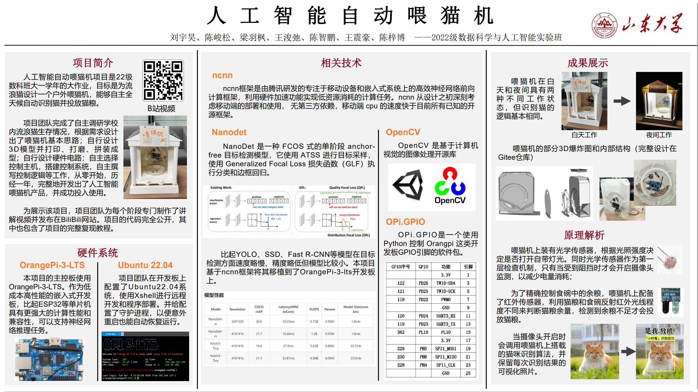

## 1. 简介

本项目是山东大学威海校区22级数科班第一学年大作业，目标是为流浪猫设计一个户外喂猫机，搭配人工智能实现自动检测猫并投放猫粮。



该项目基于 [ncnn高性能神经网络前向计算框架](https://github.com/Tencent/ncnn) 和 [Nanodet-pytorch目标检测模型](https://github.com/guo-pu/NanoDet-PyTorch)（有修改）搭建，实际部署使用搭载`Ubuntu22.04`系统的 [Orang Pi 3 LTS ](http://www.orangepi.cn/html/hardWare/computerAndMicrocontrollers/details/Orange-Pi-3-LTS.html)开发板，本文档也基于该硬件配置编写。

【注意】：该项目对于硬件环境有严格的要求，即使编者在撰写该文档前尝试复刻也遇到了很多问题。在不具备相同硬件的情况下，比较适合有 Python深度学习基础和Linux基础的人学习。

## 2. 配置环境

### 	2.1 安装 OpenCV

此处参考 [OpenCV-Python 官方教程](https://www.osgeo.cn/opencv-python/ch01-setup/sec04-setup-in-ubuntu.html)

（1）安装依赖包及 Opencv，此处可以参考香橙派官方教程中 `3.32. OpenCV 的安装方法` 部分：

```bash
sudo apt update
sudo apt install -y libopencv-dev python3-opencv
```

输入以下命令检查能否正常使用`cv2`，如果执行完成无报错并在当前目录下出现 `image.jpg` 图片文件则安装成功：

```bash
python3 -c "import cv2;cap = cv2.VideoCapture(1); ret, image = cap.read(); cv2.imwrite('./image.jpg', image)"
```


### 	2.2  编译ncnn

此处可以参考香橙派官方教程中 `3.35. 腾讯 ncnn 高性能神经网络前向计算框架测试` 部分。如果你使用的设备和我一样，你可以不必编译，直接跳过这步即可。

（1）安装依赖包：

```bash
sudo apt install -y build-essential git cmake libprotobuf-dev protobuf-compiler libopencv-dev
```

（2）进入ncnn文件夹下，输入下述命令开始编译ncnn，大约需要10~15分钟，加上散热器会快些：

```bash
mkdir build
cd build
cmake -DCMAKE_TOOLCHAIN_FILE=../toolchains/aarch64-linux-gnu.toolchain.cmake -DNCNN_SIMPLEOCV=ON -DNCNN_BUILD_EXAMPLES=ON ..
make -j$(nproc)
```


### 	2.3 安装python依赖包

进入项目根目录，输入下述代码安装 python 依赖库，根目录的`requirements.txt`已经包含了`NanoDet-PyTorch-CPU`中的依赖项，仅需要安装根目录的就行了。

```
pip install -r requirements.txt
```


### 2.4 修改gpio映射

进入python库目录，找到OPi库的位置：

```bash
cd /usr/local/lib/
find . -name "OPi*"
```

进入找到的OPi文件夹下，找到`pin_mappings.py`文件，将下面的映射字典替换原有的字典，注意只要修改`BOARD{ }`中的内容：

```python
_pin_map = {
    BOARD: {
        3: 122,
        5: 121,
        7: 118,
        8: 354,
        10: 355,
        11: 120,
        12: 114,
        13: 119,
        15: 362,
        16: 111,
        18: 112,
        19: 229,
        21: 230,
        22: 117,
        23: 228,
        24: 227,
        26: 360
    },
```

如果没有找到OPi目录，请检查之前的步骤，是否成功安装`OPi.GPIO` python 库。


## 3. 运行程序

主要程序为项目根目录的`detect_main.py`和`gpio_test.py`，文件作用顾名思义，实际检查猫时运行前者，测试gpio接口运行后者，测试其他gpio接口使用对应名称的`**_test.py`文件。
	需要用到的引脚在`gpio_test.py`中定义并注释说明了，所有的编号都是香橙派的板载编码。另外，首次运行`detect_main.py`会下载一个.pth模型，请务必联网。

在项目根目录下，输入以下命令运行程序：

```bash
sudo python3 detect_main.py
```


## 4. 项目贡献者

前期：陈峻松、刘宇昊、梁羽枫、陈智鹏、王浚弛；

后期：刘宇昊、王震豪、陈梓博；

（按贡献度从高到低排序）

开发过程讲解视频：[bilibili](https://www.bilibili.com/video/BV1NN4y1976b?vd_source=a6aba61751766c888b91980d2f024a86)

项目仓库：[Gitee](https://gitee.com/Yiqian7a/AI-Cat-Feeder)（`master`分支为主要程序，`other_design`分支为3D设计、展板等）
