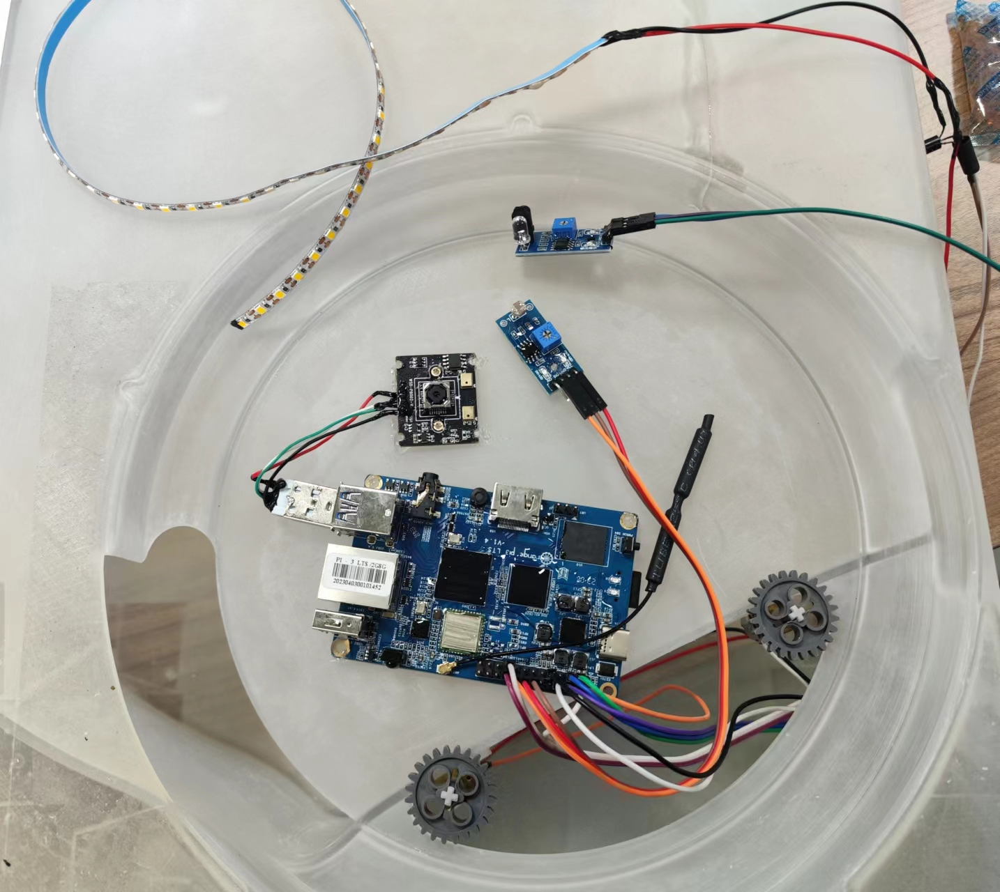
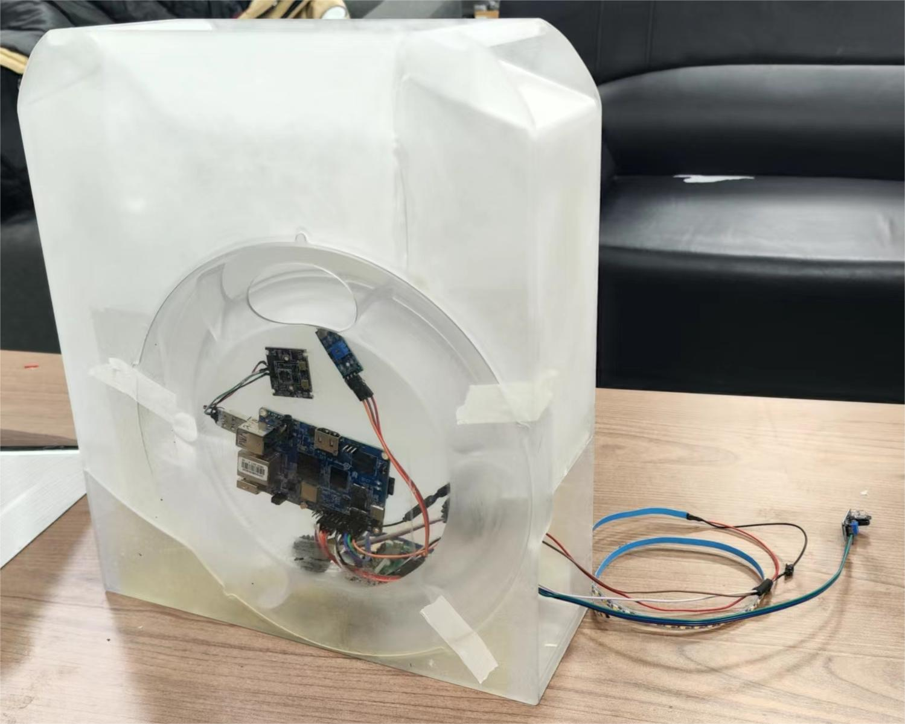

## 设计思路

### 1.1 初代设计 v1.0

在最初的v1.0设计中，我给喂猫机设计了一个雪人外形，分离储粮仓和出粮装置，使用太阳能贴条[^1]和风力供电[^2]。

雪人身体的空腔部分（左图阴影）用来放置猫粮食盆，内部中空部分用来放置其他零部件，位置示意图如右图： 

（图1.1.1）

[^1]: （左图）雪人身体部分外侧的条状阴影。
[^2]: （右图）雪人头部内可以放入风力发电机和叶片，在雪人头部的后侧有一个大进风网口，前面的两个眼睛为出风网口。

出粮装置设计如下图，其分为两个部分：

- 蓝色的旋转件，工作时顺时针旋转，将猫粮从进粮口（右图左下的外壳缺口）带到最高点，再由重力作用将猫粮从出粮口（图1.1.1右图下部）导出。旋转件的内环有传动齿轮，这里由于前期模型丢失留到最后再介绍；
- 灰色的固定外壳，用以固定旋转件。

（图1.1.2）

### 1.2 设计改良 v1.1

在完成设计v1.0 后的一段时间内，考虑到风力发电装置效率、组装接线、防水等问题，于是将雪人的头壳去除，改成了雪屋，并修改了3D设计：

（图1.2.1）

### 1.3 储粮优化 v1.2

考虑到v1.1储粮部分模型建模困难、连接组件过于复杂、更换粮食不方便等问题，我重新设计了一体式储粮送粮装置：

- 最上为进粮口，可以加上盖子；
- 主仓内有三个空腔（右图），最大的为储粮仓，左下为电机、电池仓，右下空仓没有使用；
- （左图）主仓右下角缺口凹槽为电池或用于主仓定位预留；
- （左图）控制主板和摄像头位于旋转件中间的空位（未画出），通过开孔与电池电机连接；

（图1.3.1）

### 1.3 重制模型 v2.0

v1的设计提出不久就因为球状外壳装配繁琐、装置容错率低等问题而被否决了；同时测试v1.2版本的储粮仓由于坡度不够等问题无法顺利出粮。于是我开发了v2.0版本：

（图1.3.1）

比起之前的v1.2（右），v2.0（左）版本对内部空间分配作了优化，同时增加了旋转环的尺寸和粮仓底部的倾角：

（图1.3.2）

以下是详细讲解，左图为后视图，右图为爆炸视图：

- 最上方蓝色部分为储粮仓盖，用以防水防潮，其下方左右各有一片突出的薄片，用以卡住盖子，上方有打开盖子用的扣板；
- 在主仓上方的左右两侧有两个凹槽，是主仓的提手；

- 主仓内部分为上下两部分，上半部分用以储存猫粮，下半部分用于存放电池等各种装置；
- 最前面是一个透明挡板，同时用以展示和保护内部摄像头、主板等装置；
- 左图下部可以看到齿轮的传动连接，电机驱动该齿轮以带动出粮。

（图1.3.2）

### 1.4 外壳整体 v2.1

整体外形设计为古罗马神殿风格，采用底座、外壳、屋顶三层拼装，方便拆装。主视图如下：

顶部透视图：

### 1.5 最终版 v2.2

最终版修改了正门前的两个柱子，防止猫咪卡住或进不去，同时增大了喂猫机的内部空间。

## 成品展示

最终结果请参照下面实物图：

实际使用中，转轮的设计还是容易出现卡粮的情况，因此这是一个十分大胆的设计。